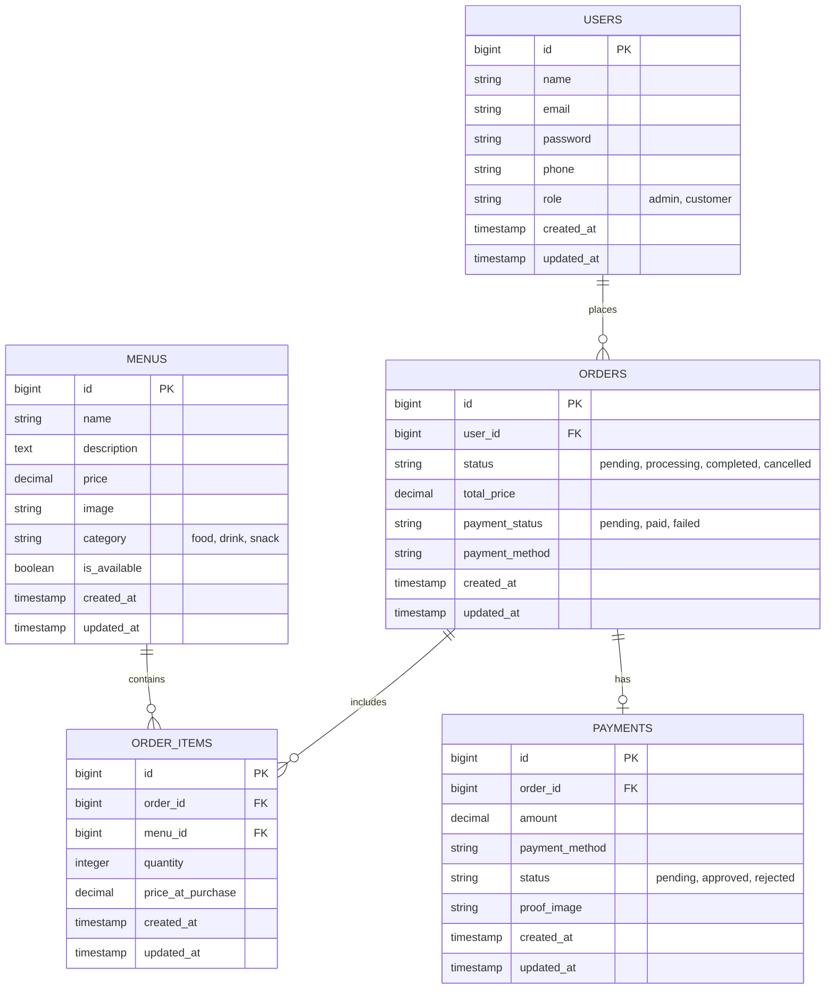

# Database Schema & Architecture

## Entity Relationship Diagram (ERD)

## Table Details

### 1. Users (`users`)
Stores all registered users, including administrators and customers.
- **Key Columns**:
    - `role`: Determines access level (`admin` or `customer`).
    - `phone`: Contact number for order coordination.

### 2. Menus (`menus`)
Catalog of food and drink items available for purchase.
- **Key Columns**:
    - `category`: Categorizes items (e.g., Food, Drink).
    - `is_available`: Toggles visibility of items without deleting them.
    - `price`: Current selling price.

### 3. Orders (`orders`)
Represents a transaction created by a user.
- **Key Columns**:
    - `status`: Tracks order progress (Pending -> Processing -> Completed).
    - `payment_status`: Tracks if the order has been paid for.
    - `total_price`: Calculated sum of all order items.

### 4. Order Items (`order_items`)
Pivot table linking Orders and Menus, capturing the state of an item at the time of purchase.
- **Key Columns**:
    - `price_at_purchase`: **Critical** for historical accuracy. Stores the price of the menu item *at the moment the order was placed*, ensuring that future price changes in the `menus` table do not affect past order records.
    - `quantity`: Number of items ordered.

### 5. Payments (`payments`)
Records payment attempts and proofs for orders.
- **Key Columns**:
    - `proof_image`: Path to the uploaded payment receipt image.
    - `status`: Admin-controlled status to approve or reject the payment.

## Tech Stack

- **Backend**: Laravel 12 (PHP 8.2+)
- **Frontend**: Blade Templates + React (Hybrid), Tailwind CSS 4
- **Database**: MySQL
- **Build Tool**: Vite
